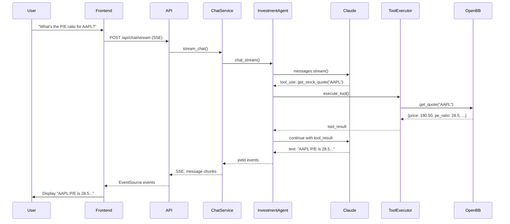
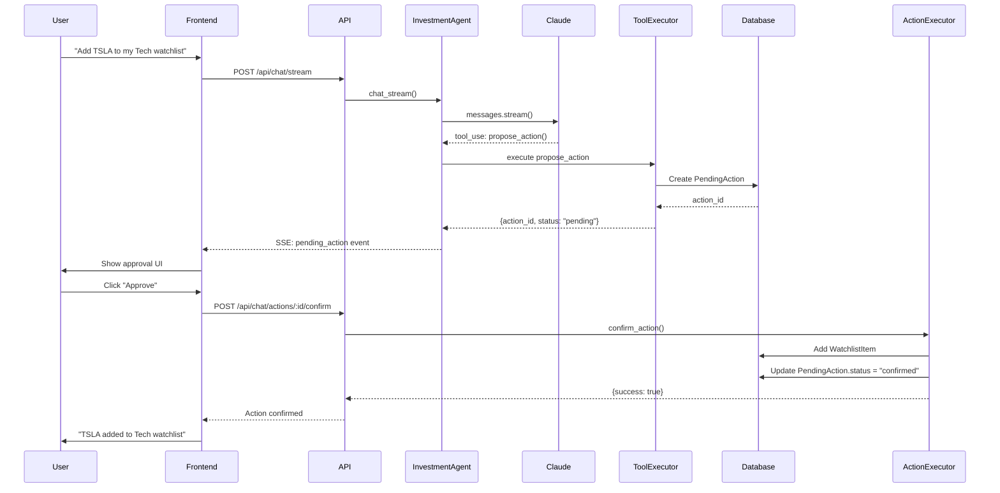

# AI Agent Architecture

**Last Updated:** 2026-03-15

The AI agent system provides conversational intelligence for stock analysis, portfolio management, and investment research using Claude via the Anthropic SDK.

## Overview

The AI agent is a full-stack feature that enables users to:
- Have natural language conversations about stocks and portfolios
- Execute tool calls for real-time market data and analysis
- Use pre-built or custom skills for specialized investment workflows
- Build personalized memory for better recommendations
- Approve pending actions before execution (watchlist modifications)

## Architecture Diagram

```
┌─────────────────────────────────────────────────────────────┐
│                         Frontend                             │
├─────────────────────────────────────────────────────────────┤
│  AISidebar                                                   │
│  ├─ Chat Interface (messages, streaming)                    │
│  ├─ Conversation History                                    │
│  ├─ Tool Call Indicators                                    │
│  └─ Pending Action Approvals                                │
│                                                              │
│  AIToggleButton (floating open/close)                       │
│                                                              │
│  SendToAIButton + useAISerializable                         │
│  └─ Component Context Capture (StockRow, PriceChart)        │
│                                                              │
│  Zustand Stores:                                            │
│  ├─ aiChatStore (chat state, SSE streaming)                 │
│  └─ aiComponentStore (component registry)                   │
└─────────────────────────────────────────────────────────────┘
                            │
                            │ REST + SSE
                            ▼
┌─────────────────────────────────────────────────────────────┐
│                      Backend API Layer                       │
├─────────────────────────────────────────────────────────────┤
│  /api/chat/*                                                 │
│  ├─ POST /conversations - Create conversation               │
│  ├─ GET /conversations - List conversations                 │
│  ├─ GET /conversations/:id/messages - Get messages          │
│  ├─ POST /stream - SSE streaming chat endpoint              │
│  ├─ POST /actions/:id/confirm - Confirm pending action      │
│  └─ POST /actions/:id/reject - Reject pending action        │
│                                                              │
│  /api/skills/*                                               │
│  ├─ GET /skills - List all skills                           │
│  ├─ GET /skills/:id - Get skill detail                      │
│  ├─ POST /skills - Create user skill                        │
│  ├─ PUT /skills/:id - Update skill                          │
│  └─ DELETE /skills/:id - Delete skill                       │
└─────────────────────────────────────────────────────────────┘
                            │
                            ▼
┌─────────────────────────────────────────────────────────────┐
│                     Service Layer                            │
├─────────────────────────────────────────────────────────────┤
│  ChatService                                                 │
│  ├─ create_conversation()                                   │
│  ├─ add_message()                                           │
│  ├─ stream_chat() - Orchestrates agent + SSE               │
│  └─ get_conversation_history()                              │
│                                                              │
│  ActionExecutor                                              │
│  ├─ confirm_action() - Execute approved action              │
│  └─ reject_action() - Mark action as rejected               │
└─────────────────────────────────────────────────────────────┘
                            │
                            ▼
┌─────────────────────────────────────────────────────────────┐
│                    AI Agent Core                             │
├─────────────────────────────────────────────────────────────┤
│  InvestmentAgent (app/agent/harness.py)                     │
│  ├─ Scratchpad-backed streaming tool-use loop               │
│  ├─ Static context_messages + rebuilt current_prompt/iter  │
│  ├─ Soft tool limits + context overflow recovery            │
│  ├─ Memory fact extraction                                  │
│  └─ Multi-turn conversation handling                        │
│                                                              │
│  Scratchpad (app/agent/scratchpad.py)                       │
│  ├─ JSONL log at ~/.nirvana/scratchpad/                     │
│  ├─ Tool call counting + Jaccard similarity dedup           │
│  ├─ clear_oldest_tool_results() - in-memory context mgmt   │
│  ├─ has_executed_skill() - skill deduplication             │
│  └─ estimate_tokens() - context threshold check            │
│                                                              │
│  ToolExecutor (app/agent/tools.py)                          │
│  ├─ get_quote() - Real-time quote                           │
│  ├─ get_price_history() - Historical price data             │
│  ├─ get_financial_ratios() - Valuation multiples            │
│  ├─ search_symbol() - Symbol lookup                         │
│  ├─ get_watchlists() / get_watchlist_items()                │
│  ├─ propose_action() - Create pending action                │
│  ├─ get_user_memory() - Fetch memory facts                  │
│  ├─ create_monitor() - Background price monitor             │
│  ├─ export_report() - Save analysis to disk                 │
│  ├─ query_market_data() - DuckDB SQL queries                │
│  ├─ heartbeat() - View/update HEARTBEAT.md checklist        │
│  └─ skill() - Invoke registered skill workflow              │
│                                                              │
│  SkillManager (app/agent/skills.py)                         │
│  ├─ get_skills_for_prompt() - metadata for system prompt   │
│  ├─ load_skill_content(name) - full SKILL.md content        │
│  ├─ Load system skills from data/system_skills/             │
│  └─ Load user skills from database                          │
│                                                              │
│  Prompts (app/agent/prompts.py)                             │
│  ├─ TOOL_PROSE - rich per-tool descriptions (13 tools)      │
│  ├─ build_system_prompt(memory, skills) - structured prompt │
│  └─ build_iteration_prompt(query, results, usage) - loop   │
└─────────────────────────────────────────────────────────────┘
                            │
                            ▼
┌─────────────────────────────────────────────────────────────┐
│                    Database Models                           │
├─────────────────────────────────────────────────────────────┤
│  Conversation                                                │
│  ├─ id, user_id, title, created_at, updated_at              │
│  └─ messages (relationship)                                 │
│                                                              │
│  Message                                                     │
│  ├─ id, conversation_id, role, content, metadata            │
│  └─ tool_calls, tool_results stored in metadata JSON        │
│                                                              │
│  MemoryFact                                                  │
│  ├─ id, user_id, fact_type, content, source_conversation    │
│  └─ Stores investment preferences, risk tolerance, goals    │
│                                                              │
│  PendingAction                                               │
│  ├─ id, user_id, conversation_id, action_type, params       │
│  └─ status (pending/confirmed/rejected), created_at         │
│                                                              │
│  Skill                                                       │
│  ├─ id, user_id, name, description, content                 │
│  └─ is_system (true for built-in skills)                    │
└─────────────────────────────────────────────────────────────┘
                            │
                            ▼
┌─────────────────────────────────────────────────────────────┐
│                   External Services                          │
├─────────────────────────────────────────────────────────────┤
│  Anthropic Claude API                                        │
│  └─ Streaming Messages API with tool use                    │
│                                                              │
│  OpenBB SDK                                                  │
│  └─ Market data (quotes, history) via FMP provider          │
└─────────────────────────────────────────────────────────────┘
```

## Key Components

### 1. Frontend Components

#### AISidebar (`frontend/src/components/ai/AISidebar.jsx`)
- Fixed right panel (400px width)
- Chat message display with role-based styling
- Conversation history dropdown
- Tool call indicators (loading spinners)
- Pending action approval UI
- SSE streaming support with real-time updates

#### AIToggleButton (`frontend/src/components/ai/AIToggleButton.jsx`)
- Floating button (bottom-right)
- Opens/closes AI sidebar
- Shows unread message indicator

#### SendToAIButton (`frontend/src/components/ai/SendToAIButton.jsx`)
- Inline button for AI-registered components
- Captures component context (props, state)
- Sends context to AI with user message

#### useAISerializable Hook (`frontend/src/hooks/useAISerializable.js`)
- Registers component for AI context capture
- Provides `serialize()` function for data extraction
- Returns `componentId` for tracking

### 2. Frontend State Management

#### aiChatStore (`frontend/src/stores/aiChatStore.js`)
- Manages chat state (messages, conversations, loading)
- SSE streaming with EventSource
- Handles tool calls and pending actions
- Exposes actions: `sendMessage()`, `loadConversations()`, `confirmAction()`, `rejectAction()`

#### aiComponentStore (`frontend/src/stores/aiComponentStore.js`)
- Registry of AI-sendable components
- Maps `componentId` to `serialize()` functions
- Used by `SendToAIButton` to capture context

### 3. Backend API Routes

#### Chat Routes (`backend/app/routes/chat.py`)
```python
POST   /api/chat/conversations           # Create new conversation
GET    /api/chat/conversations           # List user's conversations
GET    /api/chat/conversations/:id/messages  # Get conversation messages
POST   /api/chat/stream                  # SSE streaming chat endpoint
POST   /api/chat/actions/:id/confirm     # Confirm pending action
POST   /api/chat/actions/:id/reject      # Reject pending action
```

#### Skills Routes (`backend/app/routes/skills.py`)
```python
GET    /api/skills                       # List all skills (system + user)
GET    /api/skills/:id                   # Get skill detail
POST   /api/skills                       # Create user skill
PUT    /api/skills/:id                   # Update user skill
DELETE /api/skills/:id                   # Delete user skill
```

### 4. Service Layer

#### ChatService (`backend/app/services/chat_service.py`)
- Creates and manages conversations
- Persists messages to database
- Orchestrates `InvestmentAgent` for streaming chat
- Yields SSE events: `message`, `tool_call`, `tool_result`, `done`, `error`

#### ActionExecutor (`backend/app/services/action_executor.py`)
- Executes confirmed pending actions
- Supported actions: `add_to_watchlist`, `remove_from_watchlist`, `create_watchlist`, `delete_watchlist`
- Updates action status in database
- Returns execution results

### 5. AI Agent Core

#### InvestmentAgent (`backend/app/lib/agent/harness.py`)
- Wraps Anthropic SDK Messages API with scratchpad-backed loop
- Loop architecture (Dexter port):
  1. Extract `query_text` from last user message; create `Scratchpad`
  2. `context_messages` = prior turns (static); `current_prompt` rebuilt each iteration
  3. Stream `[context_messages + current_prompt]` to Claude
  4. On `BadRequestError` (overflow): clear oldest results, retry (max 2 times)
  5. For each tool call: check soft limits, execute, record in scratchpad
  6. After all tool calls: check `CONTEXT_THRESHOLD`; rebuild `current_prompt` via `build_iteration_prompt`
  7. Loop until no tool calls in response
- Constants: `CONTEXT_THRESHOLD=100_000`, `KEEP_TOOL_USES=5`, `OVERFLOW_KEEP_TOOL_USES=3`, `MAX_OVERFLOW_RETRIES=2`
- SSE events emitted: `token`, `tool_call`, `tool_result`, `action_proposed`, `tool_limit`, `context_cleared`, `done`, `error`

#### Scratchpad (`backend/app/lib/agent/scratchpad.py`)
- Append-only JSONL file at `~/.nirvana/scratchpad/{timestamp}_{md5_12}.jsonl`
- `add_tool_result(name, args, result)` — records parsed JSON or raw string
- `can_call_tool(name, query)` — warns (never blocks) when count ≥ 3 or similar query seen
- `record_tool_call(name, query)` — increments counters, stores queries for dedup
- `get_tool_results()` — formats active results as `### tool(args)\nresult`; cleared entries show placeholder
- `clear_oldest_tool_results(keep_count)` — marks oldest entries as cleared (in-memory only)
- `has_executed_skill(name)` — scans JSONL for prior skill invocations
- `estimate_tokens(system, query)` — rough estimate via `len / 3.5`

#### ToolExecutor (`backend/app/lib/agent/tools.py`)
- 13 tool definitions + FMP MCP tools (dynamic)
- Native handlers: `get_quote`, `get_watchlists`, `get_watchlist_items`, `get_price_history`, `get_financial_ratios`, `search_symbol`, `propose_action`, `get_user_memory`, `create_monitor`, `export_report`, `query_market_data`
- `heartbeat(action, content)` — reads/writes `~/.nirvana/HEARTBEAT.md`
- `skill(skill)` — calls `skill_manager.load_skill_content(name)`, returns SKILL.md content

#### SkillManager (`backend/app/lib/agent/skills.py`)
- `get_skills_for_prompt()` — returns `[{name, description}]` for system prompt injection; user skills override system on name collision
- `load_skill_content(name)` — returns full SKILL.md content (user DB first, then `data/system_skills/`)
- `get_available_skills()` — full list for UI display (existing, unchanged)
- System skills in `backend/data/system_skills/`

#### Prompts (`backend/app/lib/agent/prompts.py`)
- `TOOL_PROSE` — dict of rich 3–6 sentence tool descriptions covering what/when/when-not/tips
- `build_system_prompt(memory_facts, available_skills)` — structured sections: tool descriptions, usage policy, skills (if any), heartbeat, actions, memory, guidelines
- `build_iteration_prompt(query, tool_results, usage_status)` — rebuilds user turn: query + accumulated data + usage stats + "continue" instruction

### 6. Database Models

#### Conversation (`backend/app/models/conversation.py`)
- Tracks chat sessions per user
- Links to messages via relationship
- Auto-updates `updated_at` on new messages

#### Message (`backend/app/models/message.py`)
- Stores conversation messages
- Fields: `role` (user/assistant), `content`, `metadata` (JSON)
- Tool calls and results stored in `metadata`

#### MemoryFact (`backend/app/models/memory_fact.py`)
- Long-term user preferences and context
- Fields: `fact_type` (preference/goal/context), `content`, `source_conversation_id`
- Injected into system prompt for personalization

#### PendingAction (`backend/app/models/pending_action.py`)
- Actions awaiting user approval
- Fields: `action_type`, `params` (JSON), `status`
- Prevents unauthorized watchlist modifications

#### Skill (`backend/app/models/skill.py`)
- User-defined and system skills
- Fields: `name`, `description`, `content` (markdown)
- `is_system` flag for built-in skills

## System Skills

Five pre-built investment analysis skills shipped with the platform:

### 1. research-stock (`backend/app/agent/system_skills/research-stock.md`)
Comprehensive equity research methodology:
- Financial health analysis (revenue, margins, cash flow)
- Valuation assessment (P/E, P/B, DCF)
- Competitive positioning
- Risk factors identification
- Investment thesis synthesis

### 2. portfolio-review (`backend/app/agent/system_skills/portfolio-review.md`)
Watchlist health check and analysis:
- Diversification assessment
- Sector concentration analysis
- Risk/return profile
- Position sizing review
- Rebalancing recommendations

### 3. compare-stocks (`backend/app/agent/system_skills/compare-stocks.md`)
Side-by-side stock comparison:
- Financial metrics comparison tables
- Valuation multiples analysis
- Growth trajectory comparison
- Relative strengths/weaknesses
- Investment preference recommendation

### 4. earnings-preview (`backend/app/agent/system_skills/earnings-preview.md`)
Pre-earnings analysis framework:
- Consensus estimates review
- Historical beat/miss patterns
- Key metrics to watch
- Guidance expectations
- Risk factors for earnings

### 5. watchlist-scan (`backend/app/agent/system_skills/watchlist-scan.md`)
Quick scan for opportunities and risks:
- Price action alerts (breakouts, breakdowns)
- Momentum indicators
- Support/resistance levels
- Volume anomalies
- News-driven catalysts

## Tool Execution Flow



## Pending Action Flow

For actions requiring approval (watchlist modifications):



## Memory System

The agent extracts memory facts from conversations to personalize future interactions:

**Fact Types:**
- `preference` - Investment style, sector preferences, risk tolerance
- `goal` - Financial goals, time horizon, target allocations
- `context` - Account details, tax situation, constraints

**Extraction:**
- Happens automatically after each conversation turn
- Claude identifies relevant user information
- Stored in `MemoryFact` model linked to user
- Injected into system prompt on subsequent conversations

**Example:**
```
User: "I'm a conservative investor focused on dividend stocks"
→ Creates MemoryFact:
  fact_type: "preference"
  content: "Conservative investor preferring dividend-paying stocks"
  source_conversation_id: 123
```

## Configuration

### Environment Variables
```bash
# Required
ANTHROPIC_API_KEY=sk-ant-...

# Optional (defaults shown)
CLAUDE_MODEL=claude-3-5-sonnet-20241022
CLAUDE_MAX_TOKENS=4096
```

### Backend Config (`backend/app/config.py`)
```python
ANTHROPIC_API_KEY: str
CLAUDE_MODEL: str = "claude-3-5-sonnet-20241022"
CLAUDE_MAX_TOKENS: int = 4096
```

## Security Considerations

1. **API Key Protection**
   - `ANTHROPIC_API_KEY` stored in environment, never in code
   - Not exposed to frontend

2. **User Isolation**
   - All queries filtered by `current_user`
   - Cannot access other users' conversations or watchlists

3. **Action Approval**
   - Watchlist modifications require explicit user confirmation
   - Prevents unintended portfolio changes

4. **Input Validation**
   - All tool parameters validated (symbol format, IDs)
   - Rate limiting on API endpoints (TODO)

## Performance Considerations

1. **SSE Streaming**
   - Reduces perceived latency
   - User sees responses as they're generated
   - Tool calls shown with loading indicators

2. **Database Indexes**
   - `pending_actions.user_id` indexed for fast lookups
   - `message.conversation_id` ordered for chronological retrieval

3. **Caching** (TODO)
   - Cache frequent stock quotes
   - Cache skill definitions

## Testing

### Unit Tests (TODO)
- Tool execution with mocked OpenBB
- Memory fact extraction
- Action executor logic

### Integration Tests (TODO)
- End-to-end chat flow
- SSE streaming
- Pending action workflow

### Manual Testing
```bash
# Start backend with AI agent
docker-compose up -d
docker-compose logs -f backend

# Frontend (separate terminal)
cd frontend && npm run dev

# Test workflow:
1. Login at http://localhost:5173
2. Click AI toggle button
3. Ask: "What's the current price of AAPL?"
4. Verify tool call indicator shows
5. Verify response with quote data
6. Ask: "Add AAPL to my watchlist"
7. Verify pending action approval UI
8. Approve action
9. Verify AAPL added to watchlist
```

## Future Enhancements

1. **Additional Tools**
   - News sentiment analysis
   - Earnings transcript analysis
   - Insider trading data
   - Analyst recommendations

2. **Enhanced Skills**
   - Chart pattern recognition
   - Options strategy analyzer
   - Portfolio optimizer
   - Risk scenario analysis

3. **Multi-modal Capabilities**
   - Image analysis (chart screenshots)
   - Document parsing (10-K, 10-Q)

4. **Collaboration**
   - Share conversations with other users
   - Collaborative watchlist analysis

5. **Automation**
   - Scheduled portfolio reviews
   - Automated alerts based on AI analysis

## Troubleshooting

### "AI agent not responding"
- Check `ANTHROPIC_API_KEY` in docker-compose.yml
- Verify backend logs: `docker-compose logs backend`
- Check API quota limits

### "Tool calls failing"
- Check OpenBB API key (`OPENBB_API_KEY`)
- Verify symbol format (uppercase, valid ticker)
- Check backend logs for error details

### "Pending actions not executing"
- Verify action status in database: `SELECT * FROM pending_actions;`
- Check user permissions (must own the watchlist)
- Review backend logs for action executor errors

### "Memory facts not persisting"
- Check database connection
- Verify `ai_memory_enabled` flag on User model
- Review Claude's responses for memory extraction

## Related Documentation

- [Backend Architecture](backend.md) - Overall backend structure
- [Database Schema](database.md) - Database models and relationships
- [Frontend Architecture](frontend.md) - React components and state
- [Authentication Guide](../../guides/authentication.md) - Session management
